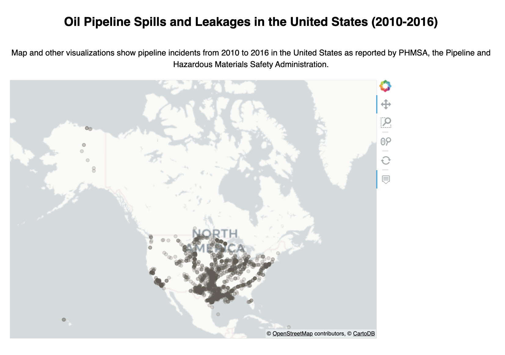

# Analysis of Pipeline Spills in the US from 2010-2016

Analysis of pipeline spills in the US from 2010-2016.

## Objective

The purpose of this project is to create data visualizations to analyze oil pipeline spills across the United States from 2010 to 2016.

### Methods Used
* Descriptive Statistics
* Spatial Visualization
* Data Visualization

### Technologies
* Python 

### Sample Data Visualizations

**[Open Interactive Visualization](pipeline_visualization.html)**

## Additional Details

For more details see:
* [Project code and visualizations](us_pipeline_data_analysis.ipynb)
* [Project paper](overview_of_us_pipeline_data_analysis.pdf)